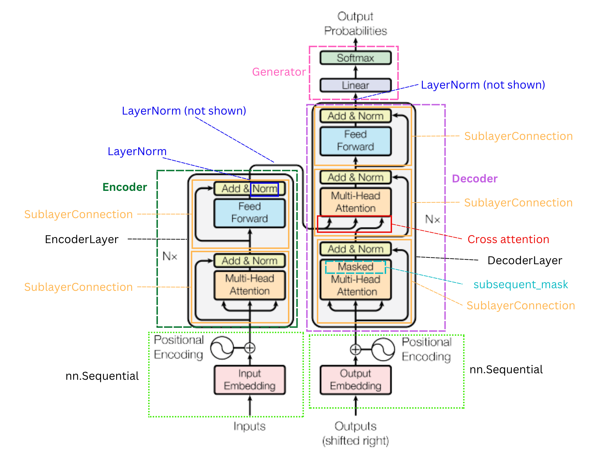

# The Annotated Transformer - Annotated

The code in this package is based on
[The Annotated Transformer](http://nlp.seas.harvard.edu/annotated-transformer/) by
Harvard NLP. I have further annotated the code including the following:

- Renaming objects that I found to be unclear or confusing.
- Adding type hinting for static type checking.
- Writing detailed docstrings explaining methods and classes that I found unclear.
- Refactoring parts of the code to improve clarity.

Below is a figure showing which components of the original transformer architecture
correspond to which classes in this subpackage.



The transformer consists of the following classes and methods:

- [`Embeddings`](embedding.py) i.e. "Input Embedding" and "Output Embedding" in the
  figure.
- [`PositionalEncoding`](transformer/positional_encoding.py)
- [`EncoderLayer`](transformer/encoder.py)
- [`Encoder`](transformer/encoder.py)
- [`DecoderLayer`](transformer/decoder.py)
- [`Decoder`](transformer/decoder.py)
- [`LayerNorm`](transformer/layer_norm.py)
- [`SublayerConnection`](transformer/sublayer_connection.py)
- [`PositionwiseFeedForward`](transformer/feedforward_net.py) i.e. "Feed Forward" in the
  figure.
- [`MultiHeadedAttention`](transformer/attention.py) which includes "Masked Multi-Head
  Attention".
- [`Generator`](transformer/embedding.py)
- [`subsequent_mask`](transformer/decoder_mask.py)

## Setup

Clone the repository:

```shell
git clone git@github.com:dluo96/transformer.git
```

Create a conda environment:

```shell
conda env create --file environment.yaml
```

Activate the conda environment:

```shell
conda transformer-env
```

Install the local package in editable mode:

```shell
pip install --editable .
```

## References
I found the following resources helpful in explaining the transformer architecture:

- [x] [Blog post on positional encoding (by Amirhossein Kazemnejad)](https://kazemnejad.com/blog/transformer_architecture_positional_encoding/)
- [x] [YouTube video on input processing (by Hedu AI)](https://www.youtube.com/watch?v=dichIcUZfOw)
- [x] [YouTube video on self-attention and multi-head attention (by Hedu AI)](https://www.youtube.com/watch?v=mMa2PmYJlCo)
- [x] [YouTube video on decoder masked attention (by Hedu AI)](https://www.youtube.com/watch?v=gJ9kaJsE78k)
- [x] [Transformers from scratch (by Brandon Rohrer)](https://e2eml.school/transformers.html)
